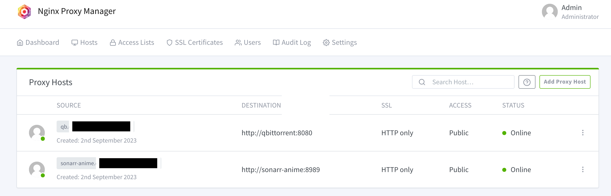

# n00bscripts & configs

### WireGuard MTU shenanigans

This one is messing with my head.

**Context**:

- Giving IPv4 internet Access to LAN devices when ISP Provides IPv6 only Connection over **PPPoE**. (à la NAT64?) which needs:
    - A Dualstack VPS
    - A Router capable of running pppd & WireGuard, bridged to IPV6-Only ISP's Modem. (I use a Raspberry Pi 4, so for simplicity this device will be referred to as `Pi`)

**Current Setup**

1. Setup a Wireguard Server on VPS
2. Setup IPv6-only PPPoE on `Pi`
3. Setup WireGuard interface `wg0` on `Pi` with:
```ini
PostUp = ip route add default dev %i
PostUp = iptables -I FORWARD -i %i -o br0 -j ACCEPT
PostUp = iptables -t nat -I POSTROUTING -s <LAN_IP>/24 -o %i -j SNAT --to-source <wg0_IP>
PostDown = iptables -D FORWARD -i %i -o br0 -j ACCEPT
PostDown = iptables -t nat -D POSTROUTING -s <LAN_IP> -o %i -j SNAT --to-source <wg0_IP>

[Peer]
...
Endpoint = [SERVER_PUBLIC_IPV6]:PORT
AllowedIPs = 0.0.0.0/0
```

***What's Happening?***
Packet Drops. LOTs of them.

If we look at the logs when `wg0` comes up we notice it setting the `MTU` as `1412`:
`[#] ip link set mtu 1412 up dev wg0`
This is exactly 80 bytes less than the `ppp0` interface's `MTU` which is [expected of WireGuard](https://lists.zx2c4.com/pipermail/wireguard/2017-December/002201.html):
```js
6: ppp0: <POINTOPOINT,MULTICAST,NOARP,UP,LOWER_UP> mtu 1492 qdisc pfifo_fast state UNKNOWN mode DEFAULT group default qlen 3
    link/ppp
```

But for some reason, this is not working well with many websites. GitHub for example does not connect at all.
If we look at the tcpdump from the VPS we find out a lot of TCP Retransmissions are happening.
This can also be seen from A simple iperf3 test:
```
[ ID] Interval           Transfer     Bitrate         Retr
[  5]   0.00-10.00  sec   233 MBytes   196 Mbits/sec  1049             sender
```

This led me to few frustrating nights trying to mindlessly figure out (google) the best MTU value without ever studying how MTU works.
1500? 1400? 1440? 1480? 1464? Some multiple of 28? or 28+8(PPPoE overhead)?

If we check tailscale0 which also uses an userspace implementation of wireguard, the MTU size they define is 1280.
I also see [this post](https://keremerkan.net/posts/wireguard-mtu-fixes/) by Kerem Erkan mentions this is the best value.
So, after setting `MTU=1280` in `Pi`'s `wg0` config, here is the iperf3 result.

```- - - - - - - - - - - - - - - - - - - - - - - - -
[ ID] Interval           Transfer     Bitrate         Retr
[  5]   0.00-10.00  sec   180 MBytes   151 Mbits/sec   14             sender
```
While the speed is low, I guess this is more stable and reliable.

---

### Cloudflare Wildcard DNS जुगाड़ through a [Tailscale](https://tailscale.com/) node

1) Fetch the Tailscale Node's IP address from your [admin console](https://login.tailscale.com/admin/machines)
2) Create an A record like *.homelab on [Cloudflare Dashboard](https://dash.cloudflare.com) and point it to the Tailscale Node's IP.

Now you can run a reverse proxy like [NginxProxyManager](https://github.com/NginxProxyManager/nginx-proxy-manager) to redirect traffic to all your services.
Just use the source as `<servicename>.homelab.\<tailnet domain>`


---

### Fun with ISP's Nokia router.
* Requires shell access.

*Nokia's router does not have PPPoE Passthrough mode. So, this series of notes are my attempts to manually make this possible through shell scripts.*
For Internet my ISP needs PPP packets to be tagged with VLAN 100.


My rPI (which I want to use for the PPP connection so it gets its own Public IP) has a static IP 192.168.5.xx.

My rPI already has a bridge br0, and at this point I am not too sure how to use pppoeconf to

First I check if I can manually add the rPI subnet to the bridge that contains the interface I have set to "Bridge Mode"

- Currently the bridge setup is like so:
```bash
br0		8000.4033064043ce	no		ecd0
							eth0.0
							eth2.0
							eth3.0
							ra0.v0
							ra1.v0
							ra2.v0
							ra3.v0
							ra4.v0
							rai0.v0
							rai1.v0
							rai2.v0
							rai3.v0
							rai4.v0
br_sfu		8000.4033064043ce	no		wan0
							eth1
```
Here, `br_sfu` are the list of interfaces that are in "Bridge Mode" (UI > Network > LAN > Port2 > Bridge Mode.)

- `ip route`s for IPv4 show 2 ppp interfaces, 1 for Internet and 1 for VOIP
```bash
default via 122.<hide> dev ppp111
10.83.90.0/23 dev pon_660_4_1  proto kernel  scope link  src 10.83.91.137
122.<hide> dev ppp111  proto kernel  scope link  src 182.<hide>
127.0.0.0/16 dev lo  scope link
192.168.1.0/24 dev br0  proto kernel  scope link  src 192.168.1.1
192.168.2.0/24 dev pon_d4097  proto kernel  scope link  src 192.168.2.2
```

- `ip a a 192.168.5.10/24 dev br_sfu` worked and I am able to Ping my rPI from within the ISP shell.
- Next we need to have an iptables rule to mask 192.168.5.0/24 to br_sfu.

----
Alternative

- I can also connect a NIC to rPI a VLAN 100 link and start a PPP session on this VLAN interface.
- To do so using `iproute2`, first we need to disable APIPA by denying the new `eth` interface on dhcpcd.conf
```
denyinterfaces eth0 eth1 eth100
```

- Create a link with vlan 100 with source `eth100`
```bash
ip link add link eth100 name eth_100 type vlan id 100
ip link set dev eth100 up
```

- Set this nic in `ppp` config
```bash
# cat /etc/ppp/peers/dsl-provider | grep nic
nic-eth_100
```
---
### Setting HTTP(s) Proxy for Dockerd on OpenWrt
```
# Modify the start_service() function to look like this:

start_service() {
	local nofile=$(cat /proc/sys/fs/nr_open)

	process_config
	export HTTP_PROXY="http://10.10.10.10:3128"
	export HTTPS_PROXY="http://10.10.10.10:3128"

	procd_open_instance
	procd_set_param stderr 1
	procd_set_param env HTTPS_PROXY="http://10.10.10.10:3128" HTTP_PROXY="http://10.10.10.10:3128"
# ...
```
---
### Zephyrus G15 2021 Linux Mods

#### Enable SysRq support

**Update: This is now merged in the [ASUS-Linux FAQs](https://asus-linux.org/faq/#i-have-an-asus-laptop-without-the-prtsc-sysrq-key-can-i-remap-any-key-to-sysrq)**

Credits: [ASUS-Linux](https://asus-linux.org/faq/#mic-mute-doesn-t-work) & [foell](https://www.foell.org/justin/remapping-keyboard-keys-in-ubuntu-with-udev-evdev)

1) **Note down the keyboard IDs using `ls -l /dev/input/by-id/usb-ASUSTeK*`**
 ```bash
 ❯ ls -al /dev/input/by-id/usb-ASUSTeK*
lrwxrwxrwx 1 root root 9 Sep 10 22:32 /dev/input/by-id/usb-ASUSTeK_Computer_Inc._N-KEY_Device-event-if00 -> ../event7
lrwxrwxrwx 1 root root 9 Sep 10 22:32 /dev/input/by-id/usb-ASUSTeK_Computer_Inc._N-KEY_Device-if02-event-kbd -> ../event6
```
The one ending with `if02-event-kbd` corresponds to the generic keys (qwerty, fn1-fn12, esc, delete etc).
Whereas the other one corresponds to the secondary actions (`VOL_UP`, `VOL_DOWN`, `MIC_MUTE`, all `fn+<key>` combos)

It is on you to decide which key you'd like to remap to SysRq.

In my case, I will choose the `menu` key (`fn+RightCtrl`) as SysRq <-> `event7` above


2) **Get the details of `Asus Keyboard` using `evemu-describe`. You may see multiple entries but for this step any one will work, for ex below it is event`6`**

```bash
❯ evemu-describe
Available devices:
/dev/input/event0:      Lid Switch
/dev/input/event1:      Power Button
/dev/input/event2:      Sleep Button
/dev/input/event3:      Video Bus
/dev/input/event4:      Asus Wireless Radio Control
/dev/input/event5:      LogiOps Virtual Input
/dev/input/event6:      Asus Keyboard
/dev/input/event7:      Asus Keyboard
...
Select the device event number [0-26]: 6
```

3) **Enter the ID in the prompt and take a note of the Properties lines:**

```bash
...
# Properties:
N: Asus Keyboard
I: 0003 0b05 19b6 0110
...
```
The first three sections (in ALL CAPS) will be required later: `0003 0B05 19B6`
These are the `bus-id` `vendor-id` and `product-id` respectively.


4) **Next, choose a key to remap and gather its KeyCode and `ScanCode` info.**
 - Since I am using `fn+RightCtrl` I'll need to scan its key/scan code by listening on `event6`.
 - If you want to choose another key (ex, the `AURA` key under `f4`) you'll have to listen to its events `event7`
 - Use `evtest /dev/input/by-id/usb-ASUSTeK....` to start listening to the key/scan codes. The output in my case:
```bash
Properties:
Testing ... (interrupt to exit)
Event: time 1662833525.476492, type 4 (EV_MSC), code 4 (MSC_SCAN), value 70065
Event: time 1662833525.476492, type 1 (EV_KEY), code 127 (KEY_COMPOSE), value 1
Event: time 1662833525.476492, -------------- SYN_REPORT ------------
Event: time 1662833525.577281, type 4 (EV_MSC), code 4 (MSC_SCAN), value 70065
Event: time 1662833525.577281, type 1 (EV_KEY), code 127 (KEY_COMPOSE), value 0
Event: time 1662833525.577281, -------------- SYN_REPORT ------------
```
From the output above, the `ScanCode` is `70065` and `KeyCode` is [`KEY_COMPOSE`](https://github.com/torvalds/linux/blob/v5.19/include/uapi/linux/input-event-codes.h#L204)

If using `AURA` key for ex, you'll have to run `evtest` on `usb-ASUSTeK..event-if00` and the output would be something like
```bash
Testing ... (interrupt to exit)
Event: time 1662834149.898966, type 4 (EV_MSC), code 4 (MSC_SCAN), value ff3100b3
Event: time 1662834149.898966, type 1 (EV_KEY), code 202 (KEY_PROG3), value 1
Event: time 1662834149.898966, -------------- SYN_REPORT ------------
```
So in this case the `ScanCode` is `ff3100b3`, currently mapped to [`KEY_PROG3`](https://github.com/torvalds/linux/blob/v5.19/include/uapi/linux/input-event-codes.h#L279)


5) **Create a udev `.hwdb` file to remap keys**
 - Create a new file in `/etc/udev/hwdb.d/` ending with `.hwdb` with the following contents
 - Substitute with your `KEYBOARD_KEY_<SCANCODE>`

```
❯ cat /etc/udev/hwdb.d/90-nkey.hwdb
# Input device ID: bus 0003 vendor 0B05 product 19B6
# evdev:input:b<bus_id>v<vendor_id>p<product_id>e<version_id>-<modalias>
evdev:input:b0003v0B05p19B6*
 KEYBOARD_KEY_70065=sysrq # force sysrq to fn+rightctrl
```
`sysrq` can be replaced with any keycode supported in this list: https://github.com/torvalds/linux/blob/v5.19/include/uapi/linux/input-event-codes.h


#### [Fix Sleep issues on SED drives](https://wiki.archlinux.org/title/Self-encrypting_drives#Waking_up_from_suspend)
```ini
[Unit]
Description=sedutil-sleep

[Service]
Type=oneshot
#Add as many ExecStart lines as needed here
ExecStart=-+/usr/bin/sedutil-sleep -n -x --prepareForS3Sleep 0 <random string of text> /dev/nvme0n1
RemainAfterExit=true

[Install]
WantedBy=multi-user.target
```
---
## Pi-Hole setup

### Description
These are my notes for future reference on how I setup my Raspberry Pi for my specific need at the time.

#### My needs
I want my Pi to act as

1. A PiHole to block ads
2. A recursive DNS resolver using unbound
3. A WireGuard VPN to access my home network
4. A WireGuard VPN "Relay" to be able to share a Single VPN connection over multiple client devices that are also WireGuard Peers
5. Manage VPN Stuff easily using PiVPN
6. Extend all these to support travelling (i.e. Using a 4g Dongle over USB)
    - This is where bridging USB and NIC comes into picture.
    - Some dongles do not allow changing the LAN subnet, so unfortunately DHCP will be required to setup the Internet facing interfaces.
7. Use it as a wireless AP to bypass dongle restrictions
~~8. Use IPv6-in-IPv4 Relay (route48) for IPV6 support~~
Let's get started.
___
#### Setting up a bridge interface configs for `systemd-networkd`
Purpose:
When using broadband, we use the gigabit NIC `eth0` however if we are to use a USB dongle, rPi will create eth1.
Settings up a "universal" bridge interface `br0` to combine both `eth0` and `eth1` will make the rest of our configuration easy, since we can just point them to `br0`

1) Creating the bridge dev `br0`:
```
root@horcrux-pi:/etc/systemd/network # cat 05-br0.netdev
[NetDev]
Name=br0
Kind=bridge
```
2) Assigning `eth0` and `eth1` to `br0`
```
root@horcrux-pi:/etc/systemd/network # cat 06-br0-eth0.network
[Match]
Name=eth0
[Network]
Bridge=br0

root@horcrux-pi:/etc/systemd/network # cat 07-br0-eth1.network
[Match]
Name=eth1
[Network]
Bridge=br0
```
3) Configureing `br0` with DHCP and setting the Master MAC
```
[Match]
Name=br0

[Network]
DHCP=yes
DNS=1.1.1.1

[Link]
MACAddress=e4:5f:01:95:ce:dd
```
Note: DNS is set here since rPi does not preserve time when off, leading to issues with `unbound`. We need this to make the Pi sync with an NTP on boot.

4) Disable DHCP on the pNICs in `/etc/dhcpcd.conf`
```
denyinterfaces eth0 eth1
```
5) Reboot & verify br0 is up and eth0 doesnt have a DHCP lease
```
2: eth0: <BROADCAST,MULTICAST,UP,LOWER_UP> mtu 1500 qdisc mq master br0 state UP group default qlen 1000
    link/ether <MAC> brd ff:ff:ff:ff:ff:ff
3: br0: <BROADCAST,MULTICAST,UP,LOWER_UP> mtu 1500 qdisc noqueue state UP group default qlen 1000
    link/ether <MAC> brd ff:ff:ff:ff:ff:ff
    inet <IP/MASK> brd 192.168.5.255 scope global br0
```

#### Setting up a wireless AP
1) Create `/etc/hostapd/hostapd.conf`
```
ctrl_interface=/var/run/hostapd
ctrl_interface_group=0
auth_algs=1
beacon_int=100

ssid=raspi-webgui
wpa_passphrase=hackmenot

# Change this to your country
country_code=US

interface=wlan0
# Uncomment if you want to use upstream router/dongle to directly handle clients
#bridge=br0
driver=nl80211

wpa=2
wpa_key_mgmt=WPA-PSK
wpa_pairwise=TKIP
rsn_pairwise=CCMP

macaddr_acl=0

logger_syslog=0
logger_syslog_level=4
logger_stdout=-1
logger_stdout_level=0

# Change this to 'a' to use 802.11ac
hw_mode=g
wmm_enabled=1

# N
ieee80211n=1
require_ht=1
# uncomment to use 802.11ac
#ht_capab=[MAX-AMSDU-3839][HT40+][HT40-][SHORT-GI-20][SHORT-GI-40][DSSS_CCK-40]
#ht_capab=[MAX-AMSDU-3839][HT40+][HT40-][SHORT-GI-20][DSSS_CCK-40]
# Comment to use AC channels
channel=11

# AC (Uncomment to use 802.11ac)
#ieee80211ac=1
#require_vht=1
#ieee80211d=0
#ieee80211h=0
#vht_capab=[MAX-AMSDU-3839][SHORT-GI-80]
#vht_oper_chwidth=1
#channel=36
#vht_oper_centr_freq_seg0_idx=42

ignore_broadcast_ssid=0
```
2) Unmask and start hostapd service
`systemctl unmask hostapd && systemctl start hostapd`

This should be enough, <ins>**however if you did not set `bridge=br0`**</ins> you'll need to setup additional configs

#### Wireless AP: Optional Steps if not using br0

We'll need to setup NAT rules, DHCP server etc
1) Install `iptables` for wlan forwarding
  `sudo apt install iptables-persistent iptables-netflow-dkms iptables nftables`
2) Set a static IP for `wlan0` in `/etc/dhcpcd.conf`
```
interface wlan0
  static ip_address=192.168.4.254/24
  nohook wpa_supplicant
```
3) Add the following dnamasq config for the wlan AP
```
no-dhcp-interface=eth1
no-dhcp-interface=eth0
no-dhcp-interface=br0
interface=wlan0 # Listening interface
dhcp-range=192.168.4.2,192.168.4.20,255.255.255.0,24h
                # Pool of IP addresses served via DHCP
domain=wlan     # Local wireless DNS domain
local=/wlan/
address=/gw.wlan/192.168.4.254
                # Alias for this router
dhcp-leasefile=/etc/pihole/dhcp.leases
dhcp-rapid-commit

#quiet-dhcp6
#enable-ra
#dhcp-option=option6:dns-server,[::]
#dhcp-range=::,constructor:wlan0,ra-names,ra-stateless,64

## This will allow you to have pihole listen on specific interfaces other than what is listed in the webui
## the current pihole options are one, or all. this let's you be a bit more precise.
interface=br0
```
4) Set the following iptables rules to forward traffic from wlan0 to our br0
`/etc/iptables/rules.v4:`
```
# Generated by iptables-save v1.8.7 on Fri Aug  5 20:34:31 2022
*nat
:PREROUTING ACCEPT [10731:800057]
:INPUT ACCEPT [9895:546267]
:OUTPUT ACCEPT [386:262218]
:POSTROUTING ACCEPT [386:262218]
-A POSTROUTING -s 192.168.4.0/24 -o br0 -m comment --comment "Dongle AP Fwd Support" -j MASQUERADE
COMMIT
```
Now you should be ready to have your Pi act like an AP and also use its inbuild PiHole to block ads

#### PiHole + Unbound setup

1) Install PiHole following the docs, choose br0 as the interface and Skip setting Static IP
2) Setup unbound: https://docs.pi-hole.net/guides/dns/unbound/
3) Disable the unbound-resolvconf service
4) Create this systemd timer to delay unbound's resolvconf service:
```
$ cat /etc/systemd/system/unbound-resolvconf.timer
[Timer]
OnBootSec=1min

[Install]
WantedBy=timers.target
```
5) Enable timer  `sudo systemctl enable unbound-resolvconf.timer`

6) Remove redundant configs from Pihole as per [this](https://www.reddit.com/r/pihole/comments/d9j1z6/unbound_as_recursive_dns_server_slow_performance/f1jnuq1/) reddit post:
```
# /etc/unbound/unbound.conf.d/pi-hole.conf
    cache-min-ttl: 0
    serve-expired: yes
# /etc/dnsmasq.d/01-pihole.conf
cache-size=0
```


## Pi-Hole modifications
### <s>Restricting access outside LAN
Added the following in `/etc/lighttpd/lighttpd.conf`</s>
```
# Only allow LAN
$HTTP["remoteip"] != "192.168.5.0/16" {
  url.access-deny = ("")
}
```

### Listen on multiple interfaces
Create or edit dnsmasq configs, in my case: `/etc/dnsmasq.d/42-wlan0_ap.conf`
```
## This will allow you to have pihole listen on specific interfaces other than what is listed in the webui
## the current pihole options are one, or all. this let's you be a bit more precise.
interface=br0
interface=wg0
```
### Restrict service access to LAN:
Use `iptables` to block connections outside LAN `/etc/iptables/rules.v4`:
```
*filter
:INPUT ACCEPT [0:0]
:FORWARD ACCEPT [0:0]
:OUTPUT ACCEPT [0:0]
-A INPUT -s 192.168.0.0/16 -p tcp -m multiport --dports 22,53,80,443,5900 -m comment --comment "Allows LAN devices to access to known services" -j ACCEPT
-A INPUT -s 192.168.0.0/16 -p udp -m multiport --dports 22,53,80,443,5900 -m comment --comment "Allows LAN devices to access to known services" -j ACCEPT
-A INPUT -p tcp -m multiport --dports 22,53,80,443,5900 -j REJECT --reject-with tcp-reset
COMMIT
```
___
## Load balancing multiple internet connections over a single NIC with help of [dispatch-proxy](https://github.com/alexkirsz/dispatch)
#### My Setup
Home LAN: `192.168.1.0/24`
ISP Gateway (`RT`): `192.168.1.1/24`
Raspberry Pi (`RPi`): `192.168.1.2/24` (Static with no default gateway)
My Laptop (`LPt`): `192.168.1.100/24` (DHCP)

I have my ISP FTTH router (`RT`) set to PPPoE passthrough mode which lets any one LAN device also send PPP requests.
This lets me have my Raspberry Pi - connected to `RT`'s LAN at `192.168.1.2` - send PPP requests and have its own PPP connection:
```
<WAN1> <WAN2>
    |    |
    |    `-RT - <PPP Public IP 1>
    |      `-br_lan - 192.168.1.1/24
    |        `-LPt
    |          `-eth0 - 192.168.1.100/24 (default gateway: 192.168.1.1)
    |        `-RPi
    |          `-eth0 - 192.168.1.2/24 (default gateway: ppp0)
    `------------`-ppp0 - <PPP PUBLIC IP 2>
```
Note: `ppp0` can be any of your internet facing interface (`eth1`/`wlan0` etc)

By design, each network can only have 1 default gateway.
However, in my case I am able to access the internet from both `RT` and `rPI` which are both under the `192.168.1.0/24` network.
`LPt` by default can only access internet through `RT`

To overcome this, we can make use of a new subnet `192.168.2.0/24` + a new routing table `100` + routing rules to use table `100` for `192.168.2.0/24`.
```
`-LPt
  `-eth0 - 192.168.1.100/24 (default gateway: 192.168.1.1, rt_table=main)
         - 192.168.2.100/24 (default gateway: 192.168.2.2, rt_table=100) *** New subnet ***
`-RPi
  `-eth0 - 192.168.1.2/24 (default gateway: ppp0)
         - 192.168.2.2/24 (default gateway: ppp0 through NAT) *** New subnet ***
```
First, setup an additional subnet within `RPi` and `LPt` only.
`LPt` & `RPi`:
```
# Add a new address
ncli connection modify Ethernet +ipv4.addresses "192.168.2.100/24"
# Or use: ip addr add "192.168.2.2/24" dev eth0
```
Next, on `LPi` add a default route via `RPi` on a separate routing table `100`
```
# Add additional default routes in separate tables
nmcli connection modify Ethernet +ipv4.routes "0.0.0.0/0 192.168.2.2 table=100"
# ip route add default via 192.168.2.2 table 100
```
Next, create a rule on `LPi` for all packets in `192.168.2.0/24` to use routing table `100`
```
# Add custom routing rules
nmcli connection modify Ethernet +ipv4.routing-rules "priority 100 from 192.168.2.0/24 table 100"
# ip rule from 192.168.2.0/24 table 100 priority 100
```
Next, on `RPi`, we need to `MASQUERADE` all incoming packets from `192.168.2.0/24` to `192.168.1.2` inorder to get out through `ppp0`.
```
sudo iptables -t nat -A POSTROUTING -s 192.168.2.0/24 -o ppp0 -j MASQUERADE
```
With this, we now have 2 separate routes a packet from `LPt` can go through.
The route is decided based on the source IP. `192.168.1.x` goes through `RT` whereas `192.168.2.x` goes through `RPi`
If you now go to https://ipleak.net and run their `Torrent Address detection` you should be seeing 2 Public IPs.
However, not all apps can make use of this. Almost everything will still go out with source address `192.168.1.x`

This is where [dispatch-proxy](https://github.com/alexkirsz/dispatch) comes in.
1. Run `dispatch list`.
```
╔════════╦═══════════════╗
║  eth0  ║ 192.168.1.100 ║
║        ║ 192.168.2.100 ║
╚════════╩═══════════════╝
```
2. Start the proxy `dispatch start 192.168.1.100 192.168.2.100`
3. Run `curl -x socks5h://localhost:1080 ifconfig.me` multiple times to verify your Public IP is changing.
4. On any app/browser that supports SOCKS5 Proxy, use 127.0.0.1:1080

### Additional ideas:
- It may not have to even be on a separate subnet, we could probably just add a new address in existing subnet set a rule just for the new IP
- These rules could be implemented on `RPi` itself and the Proxy exposed to lan. So any device in LAN will be able leverage the speeds just by setting a system-wide proxy.
___


## WireGuard config to "split-tunnel" into a VPN,

Within your VPN-provider's WireGuard config you need to make a couple of changes Inside `[Interface]` Section.
I named it wg-vpn.conf

```ini
[Interface]
# Prevent WireGuard from creating any routing tables.
# You definitely don't want your existing PiHole users to get access to this VPN
Table = off

# Create a new Routing table specific to clients connecting to VPN
PostUp = ip route add default dev wg-vpn table 1337
PreDown = ip route del default dev wg-vpn table 1337
```

Then you need to create a new WireGuard "bridge" interface config.
This cannot be your DNS-only/PiHole interface because it would then depend on `wg-vpn` interface to be always up.

I have set up my bridge interface like so:

```ini
[Interface]
Address = <NEW SUBNET (10.10.0.1/24)>
ListenPort = <PORT>
PrivateKey = <NEW PRIVATE KEY>
Table = off

# Start the VPN interface
PreUp = wg-quick up wg-vpn
# Use the VPN interface for all traffic
PostUp = iptables -w -t nat -A POSTROUTING -o wg-vpn -j MASQUERADE ; ip6tables -w -t nat -A POSTROUTING -o wg-vpn -j MASQUERADE

# All packets from this "bridge" should use our custom routing table using the VPN
PostUp = ip rule add from 10.10.0.0/24 lookup 1337
# Make this subnet reachable through this interface for all incoming packets from VPN
PostUp = ip route add 10.10.0.0/24 dev %i table 1337

# Cleanup
PreDown = ip rule del from 10.10.0.0/24 lookup 1337
PostDown = iptables -w -t nat -D POSTROUTING -o wg-vpn -j MASQUERADE; ip6tables -w -t nat -D POSTROUTING -o wg-vpn -j MASQUERADE
PostDown = wg-quick down wg-vpn

# oneplus8t-rushab
[Peer]
PublicKey = <PUB>
PresharedKey = <PSK>
AllowedIPs = 10.10.0.2/32
```
TODO:
- Figure out why the main routing table contains bridge0 route despite Table = off
- Implement Firewall to block anything outside this network
- Figure out fwmask ([tldr](https://datahacker.blog/industry/technology-menu/networking/routes-and-rules/iproute-and-routing-tables))

##### bonus config for *enterprise* VPN:
```ini
[Interface]
PrivateKey =
Address = hh.hh.hh.1/24,hx:hx:hx:h112::1/112
MTU = 1420
ListenPort = PORT
Table = off

# Use the VPN interface for all traffic
PostUp = iptables -w -t nat -A POSTROUTING -s hh.hh.hh.0/24 -o work_tun -j MASQUERADE ; ip6tables -w -t nat -A POSTROUTING -o work_tun -j MASQUERADE
# Cleanup
PostDown = iptables -w -t nat -D POSTROUTING -s hh.hh.hh.0/24 -o work_tun -j MASQUERADE; ip6tables -w -t nat -D POSTROUTING -o work_tun -j MASQUERADE
####### Interface END #######


### begin Rushab8T-Work ###
[Peer]
PublicKey =
PresharedKey =
AllowedIPs = hh.hh.hh.3/32,hx:hx:hx:h112::3/128
### end Rushab8T-Work ###
```
---

## Replace text from files
```bash
perl -pi -w -e 's/<OLD>/<NEW>/g;' <filename>
```
Replace `<OLD>` with the current tag and `<NEW>` with the new one

## Recursively Check for missing/corrupted FLAC files
```bash
grep -a -L -r -E --include="*.flac" "libFLAC|fLaC"
```
## Check for files that weren't properly encoded to OPUS
```bash
# Finds all *.flac files and sends the sorted list to a.txt
find . -name "*.flac" | sort > a.txt

# Using git to commit the file list inorder to do a git diff later.
git init . ; git add a.txt ; git commit -m "Init"

# Finds all encoded *.opus files, renames the extension to .flac and overwrites a.txt with the new list.
find . -name "*.opus" | sort | sed 's/.opus$/.flac/g;' > a.txt

# The FLAC files which are corrupted are now shown "missing" in the new list (As they couldn't be encoded).
git diff a.txt
```

## Archive SCANS folders from FLAC rips to reduce no. of files.
```bash
export CWD="$PWD"
export array=()
while IFS=  read -r -d $'\0'; do
    array+=("$REPLY")
done < <(find . -type d \( -iname "scan*" -o -iname "*bookl*" \) -print0)
for i in "${array[@]}"
do
        BASEDIRNAME=$(basename "$i")
        PARENTDIRNAME=$(dirname "$i")
        cd "$PARENTDIRNAME"
        rar a "$BASEDIRNAME".rar -m0 -df "$BASEDIRNAME"
        cd "$CWD"
done
```

## Backup the rootfs of Ubuntu 18.04 with Multi-Threaded compression (Requires pxz).
```bash
# This may be useful: https://github.com/azuer88/grub-mkconfig_lib-patch
XZ_OPT=-9 tar -I pxz -cp \
--exclude=/backup.txz.gpg \
--exclude=/proc \
--exclude=/tmp \
--exclude=/mnt \
--exclude=/dev \
--exclude=/sys \
--exclude=/swap.img \
--exclude=/run \
--exclude=/media \
--exclude=/var/log \
--exclude=/var/cache/apt/archives \
--exclude=/usr/src/linux-headers* \
--exclude=/home/*/.gvfs \
--exclude=/home/*/.cache \
--exclude=/home/*/.ccache \
--exclude=/home/*/.local/share/Trash \
--exclude=/home/*/los \
--exclude=/home/*/.gdfuse/*/cache / | gpg -e -r <email id> -o backup.txz.gpg
```

## To extract the backup and install the system:
```bash
gpg --armor  --export-secret-keys <email id> > private.key
gpg --import private.key
gpg -d backup.txz.gpg | tar -xJ

for i in /dev /dev/pts /proc /sys /run; do sudo mount -B $i /mnt$i; done
chroot /mnt
grub-install /dev/sda
```

## Modify Media file timestamps from the names
#### Must be of format IMG-YYYYMMDD-randomtext.jpg"
```bash
for i in "$(cat /sdcard/WAIMAGES.txt)"
do
    TIMESTAMP="$(echo $i | awk -F '-' '{print $2}')";
    touch -c -t "$TIMESTAMP" $i
    ls -l $i
done
```
####  This is for format IMG_20190629_142823_662.jpg used by telegram
```bash
find . -type f -name "*201*" > /sdcard/tg.txt
for i in "$(cat /sdcard/tg.txt)"
do
    TIMESTAMP="$(echo $i | awk -F '_' '{print $2$3$4}')";
    TIMESTAMP="${TIMESTAMP::-4}" # Remove extension
    touch -c -t "${TIMESTAMP:0:12}.${TIMESTAMP:12}" $i
    ls -l $i
done
```


## ADB - recursively scan media from [find result](https://stackoverflow.com/questions/1279953/how-to-execute-the-output-of-a-command-within-the-current-shell)
```bash
find /sdcard/ -type f -iname "*.flac" |sed -e "s|^|am broadcast -a 'android.intent.action.MEDIA_SCANNER_SCAN_FILE' -d file://\"|g;" -e "s|$|\"|g;"| source /dev/stdin
```
```text
Explanation:
1) find /sdcard/ -type f -iname "*.flac"
 - Prints all the matched files.

2) sed -e "s|^|am broadcast -a 'android.intent.action.MEDIA_SCANNER_SCAN_FILE'
 - Replaces the start of each `find` result with
 am broadcast -a 'android.intent.action.MEDIA_SCANNER_SCAN_FILE'
 - -d file://\"|g;" Then adds a " at the end of file:// to complete the string as:
 am broadcast -a 'android.intent.action.MEDIA_SCANNER_SCAN_FILE' -d file://"

3)  -e "s|$|\"|g;"
 - appends " at the end of the output to close the " in step 2

4) | source /dev/stdin
 - Executes the output as a command
```

## RSync - Sync sdcard & PC, remove deleted items in target
 - Phone to PC
```bash
rsync -av --recursive -P --dry-run -e "ssh -i /data/ssh/ssh_host_rsa_key" /sdcard/ username@IP:~/Android/sdcard --delete
```
 - PC to Phone (Needs root for `/sdcard/Android/obb` )
```bash
rsync -av --recursive -P --dry-run -e  "ssh -i /sdcard/.ssh/id_ed25519" username@IP:~/Android/sdcard/ /sdcard --delete
```


## There are just few simple shell 1-liners I keep forgetting. Hopefully I don't get lazy to update this file after I google the things I need.

#### `find` and empty the contents of files:

```bash
find . -type f -exec truncate -s 0 {} \;
```
---
#### Take each line from a text file as an input (useful if you redirect the o/p of a find result to a file).
 - #### *This MAY NOT escape special characters!*
```bash
while read p; do ls -al "$p" ; done < list.txt
```
---
#### [Build AOSP without getting bullied by metalava](https://sx.ix5.org/info/building-android/#fnref:2)
 - ##### *NOTE: Does not seem to work :(*
```bash
WITHOUT_CHECK_API=true
```
---
#### [Screen - start screen in detached mode](https://superuser.com/a/454914)
```bash
screen -d -m <yourcommand>
```
---
#### Gerrit - search term to view all merged non-device related changes
```
status:merged -project:^LineageOS/android_device.+  -project:^LineageOS/android_kernel.+
```
---
#### RAR Archive folders with password in background:
```bash
for i in *NEF; do screen -d -m rar a -p'password' ~/Pictures/"$i.rar" -m0 -v500M -r "$i"/* ; done
```
---
#### [`find` multiple matching names using OR operation and exec a command](https://unix.stackexchange.com/a/50613)
```bash
find . -type f \( -name "*REAL*" -o -name "*FAKE*" -o -name "*mp3" \) -exec basename {} \;
```
---
#### `find` above and create replica dir structure from the result
 - ##### *Not tested against specal characters*
```bash
 find . -type f \( -name "*REAL*" -o -name "*FAKE*" -o -name "*mp3" \) -exec dirname {} \; | xargs -I {} bash -c 'mkdir -p ./FAKES/"{}"'
```
---
#### [`find` Directory structure as CSV](https://stackoverflow.com/a/58606757)
```bash
find . -maxdepth 2 -mindepth 2 -type d | sort | sed 's:./::;s:/:",":;s:^:":;s:$:":g;' > file.csv
```
---
#### [`sed` - Convert synced LRC to unsynced LRC](https://unix.stackexchange.com/a/187894/261206)
```bash
sed -r -i 's/^\[(.*)\]//' "$FILE"
```
---
#### [RegEx to match duplicate lines](https://stackoverflow.com/questions/1573361)
```bash
^(.*)(\r?\n\1)+$
```

#### Substitute find result as argument in a command and run it in background
```bash
find -iname "*flac" -exec ls -Q {} \; | sed 's/$/ \&/; s/^/md5sum /' > ~/tmp/bg_tasks.sh
```

#### [And then run 10 threads, wait for it to finish, run 10 more.](https://stackoverflow.com/questions/356100/how-to-wait-in-bash-for-several-subprocesses-to-finish-and-return-exit-code-0)
```bash
 sed '0~10 s/$/\nwait\necho WAITING.../' < bg_tasks.sh > waiting_tasks.sh
```
---
#### [Find & display only files that do not have lyrics](https://stackoverflow.com/questions/23740545/how-to-print-only-the-unique-lines-in-bash)
```bash
find \( -name "*lrc" -o -name "*flac" \) | sed -e "s/.flac$//g;" -e "s/.lrc$//g;" | sort | uniq -u
```
---

#### [AWK - Netstat - Print time and connections](https://stackoverflow.com/questions/17001849/awk-partly-string-match-if-column-word-partly-matches)
```bash
awk -F '[[:space:]][[:space:]]+' ' $1~/TIMEST/ { print } { print $5 }' /tmp/netstat_connections.txt | head
```
---

#### [Regex match all language characters, but stop at 2nd occurrance of tab](https://stackoverflow.com/questions/2013124/regex-matching-up-to-the-first-occurrence-of-a-character)
```perl
^(ID|[0-9]+)\t+([\x00-\x7F]|[^\x00-\x7F])(.*?)\t

Example:
ID			artist	title	error
91092377	Seether	I've Got You Under My Skin	Your account can't stream the track from your current country and no alternative found.

Matches till BEFORE the TITLE column
```
---

#### NX Tar extract manually collected bundles and strip unnecesarry folders:
```bash
for i in *tar.gz; do j="${i%.tar.gz}"; mkdir $j; tar -C $j -xf $i --strip-components=4; done
```
---

#### [Print all lines after matched pattern](https://stackoverflow.com/questions/5346896/print-everything-on-line-after-match)
```bash
awk '/### begin/ {seen = 1} seen {print}' wg0.conf
```
---
#### [AWK - Print first column after all other columns](https://stackoverflow.com/a/4198169/6437140)
```bash
$ git log --oneline COMMIT~1..COMMIT | awk '{first = $1; $1 = ""; print $0, first; }'
 <COMMITmessage> <commitsha>
```
---
#### [Log to journald](https://serverfault.com/a/573951/535443)
```bash
echo 'hello' | systemd-cat -t someapp -p emerg
# Logged as
Feb 07 13:48:56 localhost.localdomain someapp[15278]: hello
```
---
#### [Remove Zsh duplicate history](https://www.quora.com/How-do-I-remove-duplicates-and-sort-entries-in-zsh-history)
```bash
cat -n .zsh_history | sort -t ';' -uk2 | sort -nk1 | cut -f2- > .zsh_short_history

mv .zsh_short_history .zsh_history

Explanation

(1) add line number column to keep track of order: cat -n .zsh_history

(2) sort by command and keep unique commands only: sort -t ';' -uk2

note: need to set ';' as the sort delimeter because of zshell datetime stamp

(3) sort now by the line number added before: sort -nk1

(4) remove line number column added in the first step: cut -f2-

(5) save under new file: > .zsh_short_history

(6) replace zshell history file: mv .zsh_short_history .zsh_history
```
#### [Simple C code to send keystrokes to current window using `xdotool`](https://stackoverflow.com/questions/1262310/simulate-keypress-in-a-linux-c-console-application)
Useful to map a keyboard shortcut to type frequently used text like email addresses!
```C
#include <xdo.h>
int main() {
    xdo_t * x = xdo_new(":0.0");
    xdo_enter_text_window(x, CURRENTWINDOW, "ThisIsAText", 0);
    return 0;
}
```

---
#### ADB shell command to allow KDE Connect Notification Access
`cmd notification allow_listener org.kde.kdeconnect_tp/org.kde.kdeconnect.Plugins.NotificationsPlugin.NotificationReceiver`

---
#### [Update cloudflare IP range for nginx](https://frankindev.com/2020/11/18/allow-cloudflare-only-in-nginx)
```bash
#!/usr/bin/bash

set -e

cf_ips() {
echo "# https://www.cloudflare.com/ips"

for type in v4 v6; do
echo "# IP$type"
curl -sL "https://www.cloudflare.com/ips-$type/" | sed "s|^|allow |g" | sed "s|\$|;|g"
echo
done

echo "# Generated at $(LC_ALL=C date)"
}

(cf_ips && echo "deny all; # deny all remaining ips") > /etc/nginx/allow-cloudflare-only.conf

# reload Nginx
# sudo systemctl reload nginx
```

---
#### `find` all files that contain a crc32 code
```bash
find . -type f -regextype posix-extended -iregex '.*\[[0-f]{8}\][^/]*'
```

---
#### Download latest MergerFS
```bash
export release_type=jammy_amd64
wget $(curl -s https://api.github.com/repos/trapexit/mergerfs/releases/latest | jq -r ".assets[] | select(.name | test(\"${release_type}\")) | .browser_download_url")
sudo dpkg -i mergerfs_*$release_type.deb
```

---
#### Download latest Hugo
```bash
export release_type=linux-amd64.deb
curl -s https://api.github.com/repos/gohugoio/hugo/releases/latest | jq -r ".assets[] | select(.name | test(\"${release_type}\")) | .browser_download_url"
# Now select the normal or extended version and download via wget
```
